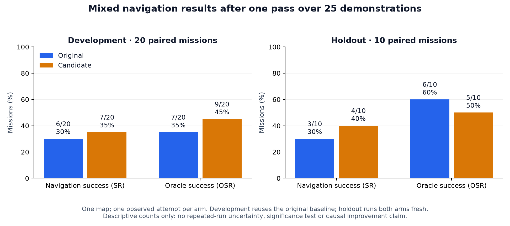

# UAV-VLA-Lab

**A research project for studying vision-language-action UAV navigation in simulation.**

[Results](docs/research/results.md) · [Research report](docs/research/technical-report.md) · [PDF](docs/research/report.pdf) · [Videos](docs/research/videos.md) · [Experiment data](experiments/simulation-sft-v1/) · [File structure](docs/FILE_STRUCTURE.md)

UAV-VLA-Lab brings the completed AeroVLA/TravelUAV experiments together in one project: demonstration review, policy adaptation, closed-loop evaluation, and the evidence needed to inspect the results.

## Research question

**Does a small amount of adaptation on published demonstrations improve navigation, and where does it regress?**

We trained one fixed candidate with **25 updates over 25 unchanged published demonstrations**, then compared it with the released parent on **20 development missions and 10 holdout missions**. The candidate was fixed before either comparison.

## Results

| Evaluation | Original success | Adapted success | Original oracle success | Adapted oracle success |
|---|---:|---:|---:|---:|
| Development — 20 pairs | 6/20 | 7/20 | 7/20 | 9/20 |
| Holdout — 10 pairs | 3/10 | 4/10 | 6/10 | 5/10 |

The adapted policy gained one success in each cohort, while holdout oracle success fell by one. Development contained three gains and two regressions; holdout contained two gains and one regression.

These are **mixed results from a small, single-map study**. They do not establish broad or causal improvement. Development reused the recorded original baseline; both holdout arms ran fresh. The task retains target-bearing assistance and upstream success definitions. [Methods and limitations](docs/research/technical-report.md)

## Why this work matters

Aggregate scores can hide regressions. This project preserves both sides of each comparison and connects the training record to the exact candidate that was evaluated.

Its contribution is an inspectable research workflow and a documented pilot: **60 scored episodes, 30 paired comparisons, 25 training updates, and evidence of both successful and failed behavior**. AeroVLA supplies the policy method and TravelUAV supplies the benchmark assets.

## Explore the work

| Output | What you can inspect |
|---|---|
| [Research report](docs/research/technical-report.md) · [Download PDF](docs/research/report.pdf) | Research question, method, results, interpretation, and limitations. |
| [Charts and result tables](docs/research/results.md) | Outcome rates, paired gains/regressions, and training fit. |
| [Study videos](docs/research/videos.md) | Recorded observations, demonstration review, training, and paired comparisons. |
| [Public research data](experiments/simulation-sft-v1/README.md) | Episode rows, paired results, training records, and source identities. |
| [Model card](docs/research/model-card.md) and [dataset card](docs/research/dataset-card.md) | Candidate lineage, demonstration construction, and known limitations. |
| [Source code](src/uav_vla_lab/) | Shared simulation, data, training, evaluation, and reporting workflows. |

All parts belong to **one research project**. Earlier phase labels remain only as references to the development history and recorded evidence.

## References and license

The project builds on [AeroVLA](https://github.com/XuPeng23/AeroVLA) and [TravelUAV](https://github.com/prince687028/TravelUAV). See the [report's related work](docs/research/technical-report.md) for the research context.

Project-owned code uses [Apache-2.0](LICENSE). Upstream code, models, and datasets retain their own terms; see [third-party notices](THIRD_PARTY_NOTICES.md). Use [CITATION.cff](CITATION.cff) to cite this software. This repository is a research artifact, with no claim of peer review or state-of-the-art performance.
