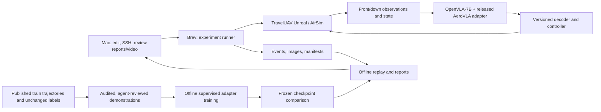

# AeroVLA implementation plan — short MVP releases

**Approved planning baseline; execution began 7 September 2026 UTC.** Phase scopes below remain the delivery plan. Use [public results and limits](../PUBLIC_STATUS.md) for verified completion and failures; private dated evidence remains separately retained.

The objective is a working simulation-to-training-to-evaluation loop using the released AeroVLA policy and compiled TravelUAV environments. Level 1 is excluded. This document refines the broad stages in [SYSTEM_DESIGN.md](SYSTEM_DESIGN.md) into independently reviewable releases.

## 1. Planning boundaries

The Mac is the operator workstation and the remote L40 host owns simulator, policy and training execution. Runtime admission used measured capacity, not the advertised allocation. Detailed host inventory and private operating paths are retained outside this reduced public copy. Stop/resume storage persistence remains unverified.

All phase sizes below are **proposed work limits**, not claims of statistical adequacy, known data availability, or completion-time estimates. Each release adds one capability and reuses prior capabilities. If a dependency fails, retain the evidence and split out the compatibility fix; do not expand a phase into a general simulator rewrite.

| Resolve | Deadline | How it is resolved |
|---|---|---|
| Remote platform, persistent mount, available space | P01 | Inspect the actual host; record evidence |
| Initial map and required asset subset | P02 | Match executable, episode metadata and all referenced files; check capacity |
| Known-target-bearing reproduction or unknown-target navigation | Before P05 | Initial implementation uses the original released target-bearing-assisted task. Unknown-target navigation is a separate changed protocol |
| Clocks, stopping, parsing and controller behavior | Before P06; freeze before P08 | Record upstream behavior and any deliberate changes as named protocol versions |
| Train/dev/holdout membership | Before P08 evaluation | Exclude earlier demo material from holdout; hash the split manifest |
| Correction source and action-label horizon | Before P09 | Define the expert, coordinate frame, temporal meaning, validation and stop labels |
| Training budget, expanded dataset size and checkpoint selection | Before P12 | Use measured capacity and a written experiment configuration |
| Held-out scope and statistical claim | Before final test | Define supported claim and sample size; the small P14 pilot does not establish broad improvement |

These are decision gates, not repeated installation-permission requests. The user authorized remote implementation through these phases; the current execution status is recorded separately from the plan.

## 2. Architecture and implementation choices



The diagram reflects the explicit P09/P11 execution amendment below: this cycle uses ordinary published demonstrations, with evaluation evidence kept separate from training membership. Original phase proposals and their exact scope amendments remain visible.

Simulation and policy inference share the Brev host. Begin with one scene and one policy. Training uses the same GPU in a separate job after simulator processes are stopped. The Mac reviews selected artifacts and does not sit in the per-action network path.

| Layer | Proposed implementation | When delivered |
|---|---|---|
| Source and configuration | Git, pinned upstream checkout, recorded patches, YAML configs, JSON manifests | P01 onward |
| Remote environment | Isolated Python 3.10 environment; install route selected after host inspection | P01–P05 |
| Simulator | Compiled TravelUAV environment, AirSim client, supervised native processes | P02–P04 |
| Policy | OpenVLA-7B plus released AeroVLA adapter; original Python integration | P05 |
| ML reference | PyTorch 2.1.2/cu118, Transformers 4.42.4, PEFT 0.11.1; complete dependency list in system design | P05; compatibility verified on host |
| Runner and data | Python module interfaces; JSONL events; PNG observations; CSV metrics | P06–P09 |
| Training | Explicit continuation of released adapter, saved projector and parent provenance | P10–P12 |
| Reporting | Small Python analysis tools, Markdown plus browsable HTML, measured plots | Every phase, expanded P08/P13 |
| Video | Actual evidence capture, offline FFmpeg encoding, ffprobe inspection, captions | Every phase |

The author repository documents the reference installation and compiled-environment route. It was the reference baseline; compatibility and named changes required their own measured gates. [AeroVLA repository](https://github.com/XuPeng23/AeroVLA).

## 3. Fourteen small releases

**Every phase delivers the common release bundle in section 4.** The report/video entries below specify the evidence unique to that phase; they are acceptance criteria rather than completion claims. A valid negative research result can satisfy an engineering gate; an infrastructure crash does not count as a completed navigation trial.

### P01 — Host readiness MVP

- **Working result:** a repeatable host diagnostic that writes a readiness report and a source/configuration inventory.
- **Scope:** inspect the actual Brev allocation, mounts, permissions, graphics and GPU; choose a persistent data root; establish an isolated runtime and durable remote session as supported by that host.
- **Acceptance:** inventory is saved; unknowns are explicit; CUDA/graphics prerequisites have evidence; the next installation/download has a measured storage budget. A failing prerequisite produces a failed gate, not an invented pass.
- **Report:** actual hardware, OS, driver, free bytes, persistence evidence, dependency findings and next actions.
- **Video:** real terminal walkthrough of the diagnostic and generated report.
- **Main additions:** `host.py`, `cli.py`, `configs/host.yaml`, `docs/runbooks/host.md`.

### P02 — One-map asset package MVP

- **Working result:** a validator can resolve one selected environment and its required episode files.
- **Scope:** lock source/model references; download only necessary map bundle parts and metadata/raw content. The complete dataset is not the initial acquisition unit.
- **Acceptance:** hashes, revisions, archive parts, extracted paths, permissions and referenced files verify; actual extraction fits the storage budget. Missing metadata stops the gate.
- **Report:** asset inventory, dependency mapping, compressed/extracted sizes and remaining capacity.
- **Video:** validator run showing the selected map and the verified file inventory.
- **Main additions:** `assets.py`, `configs/assets.yaml`, asset manifest schema.

### P03 — Simulator observation MVP

- **Working result:** launch one map, reset a demo episode, obtain genuine front/down images and state, then clean up owned processes.
- **Scope:** simulator and sensor path only; repeat launch/reset/capture to expose lifecycle errors. Mark all inspected demo missions so they cannot enter the untouched holdout.
- **Acceptance:** images have valid shape/channel interpretation; state and available timestamps are recorded; restart and cleanup work; actual generated settings and ports are saved.
- **Report:** startup/capture timings, camera inventory, settings and lifecycle results.
- **Video:** actual camera views with launch/reset/capture evidence, labeled as a simulator demonstration.
- **Main additions:** `simulator.py`, `observation.py`, simulator runbook.

### P04 — Controller MVP

- **Working result:** issue bounded scripted commands with understood coordinate signs and execution behavior.
- **Scope:** isolated heading, horizontal and vertical probes from controlled starting states; define numerical tolerances in the probe config before running.
- **Acceptance:** requested actions link to actual API calls and measured displacement/orientation; units and signs agree with observations; stop behavior and command errors are accounted for.
- **Report:** requested-versus-applied motion, timing, tolerances, contacts and deviations.
- **Video:** the three motion probes with telemetry, clearly labeled scripted control.
- **Main additions:** `controller.py`, action schema, `configs/controller_probes.yaml`, meaningful coordinate/codec checks.

### P05 — Offline policy MVP

- **Working result:** the released model consumes recorded front/down observations and produces inspectable actions.
- **Scope:** three genuine observation pairs; resolve the goal-information task choice first. Pin model/adapter/processor revisions and preserve the exact prompt and raw generation.
- **Acceptance:** load and preprocessing work; tensors and output parsing are checked; invalid generation is explicit; latency and memory are measured. No simulator command is sent by this test.
- **Report:** input provenance, prompt, tokens, decoded outputs, invalid cases and resource usage.
- **Video:** image pair → actual prompt → real generation → decoded action, labeled offline inference.
- **Main additions:** `policy.py`, `prompt.py`, `codec.py`, `configs/policy.yaml`.

### P06 — One closed-loop episode MVP

- **Working result:** one mission runs through observation, inference, command execution and termination on Brev.
- **Scope:** one bounded attempt with explicit duration/step limits and protocol settings. For official reproduction, retain a pinned upstream-protocol reference attempt before behavior-changing patches. Label later protocols separately from model-weight identity; unknown-target mode is a changed task. Include minimal causal event logging now; later phases extend it.
- **Acceptance:** each decision links to its observation and applied command; a valid outcome or truthful failure is recorded; combined GPU demand is measured; owned processes are released. Navigation success is not required to prove loop integration.
- **Report:** complete step trace, termination reason, resource peak and missing/invalid fields.
- **Video:** actual observation sequence and requested/applied actions; annotate sampling and speed.
- **Main additions:** `runner.py`, `monitor.py`, initial `recorder.py`, episode config.

### P07 — Replay and interruption handling MVP

- **Working result:** inspect an episode from saved evidence and preserve an interrupted run without corrupting completed data.
- **Scope:** two attempts, including one controlled interruption. Start a new attempt after interruption; do not imply exact physics-state resumption.
- **Acceptance:** event/image references resolve; partial events survive interruption; attempts remain separate; the recorded sequence can be reviewed on the Mac. Measure recording overhead because the upstream simulation can advance during inference.
- **Report:** artifact integrity, interrupted-attempt accounting, recovery procedure, bytes per episode and timing impact.
- **Video:** actual replay plus the interruption/restart evidence. This is process recovery, not learned flight recovery.
- **Main additions:** completed `recorder.py`, `replay.py`, `reporting.py`, media validation tools.

### P08 — Baseline evaluation MVP

- **Working result:** evaluate the original policy on a frozen development batch and regenerate its results from stored artifacts.
- **Scope:** proposed 20 unique development mission IDs; first partition training/development/holdout and exclude earlier demo exposure from holdout. Prefer official evaluation splits for reproduction. Record known or unknown overlap with the released model's training data: project holdout alone does not establish unseen-to-model data. Confirm holdout assets and whether it will test new missions or a new map. Freeze protocol and retry policy.
- **Acceptance:** all planned trials and actual attempts are accounted for; scores recompute; failure categories are reviewed against raw evidence; timing/resource distributions and uncertainty limitations are stated.
- **Report:** per-mission CSV, aggregate metrics, contacts versus heuristic failures, latency and storage charts.
- **Video:** summary plus clips chosen under a declared rule, including a failure if one occurred.
- **Main additions:** `analysis.py`, `splits.py`, split/protocol manifests, baseline runbook.

### P09 — Reviewed supervision MVP

**Execution amendment, 7 September 2026:** the initial correction proposal below is implemented in this cycle as ordinary published demonstration SFT. The [alignment decision](REFERENCE_ALIGNMENT_DECISION.md) records why the heading-correction prototype was deferred and how exact source motion, instructions and images are independently reviewed. Five unchanged published rows passed that qualified review. This cycle does not deliver newly collected model-failure corrections or a learned-recovery claim. The original proposal remains visible in the scope below so the difference is explicit.

- **Working result:** export a small, auditable set of supervised corrections compatible with the training reader.
- **Scope:** proposed five approved observation/action samples from separate training missions. Define expert source, action horizon, units, stop semantics and approval process before collection. Reject unsupported labels.
- **Acceptance:** each label references its exact images/state; source and review are recorded; bounds, semantics and train/dev/holdout separation validate. Do not label the original model's motion as expert supervision by default.
- **Report:** dataset card, accepted/rejected samples, temporal-label specification and provenance audit.
- **Video:** inspect actual observations, correction rationale and resulting export rows.
- **Main additions:** `corrections.py`, `dataset.py`, schema validators and dataset card template.

### P10 — Training mechanics MVP

- **Working result:** continue the released adapter for one optimizer update, save it, and reload it for inference.
- **Scope:** tiny P09 dataset; trainable-adapter loading with projector preservation; simulator stopped. This checkpoint is a mechanics artifact.
- **Acceptance:** intended parameters receive gradients; loss is finite; weights change; save/reload retains state; parent/dataset/config hashes are recorded; memory is measured. One update does not demonstrate useful adaptation.
- **Report:** trainable tensor audit, batch configuration, optimizer step, losses and reload checks.
- **Video:** real update logs, checkpoint inspection and reloaded inference.
- **Main additions:** `training.py`, checkpoint manifest, training/reload checks.

### P11 — Versioned training dataset MVP

For this execution, the increment is twenty unchanged published examples from twenty additional official training missions, selected under `aerovla-reference-extension-twenty-v1` before alignment review. The original five are preserved. Labels are neither corrected nor replaced to force acceptance; every selected row must pass the same qualified review before the 25-example union can be packaged. This is the reference-SFT scope recorded at P09.

- **Working result:** grow the reviewed correction corpus through repeatable, independently validated increments.
- **Scope:** proposed cap of 20 newly approved samples per release; repeat with a new release ID as needed. Choose total size and coverage after baseline review; this cap is not a claim that 20 samples are sufficient.
- **Acceptance:** all new labels pass P09 semantics; no split leakage or accidental duplicates; dataset revision is immutable; coverage and expert effort are reported. Sampling rules use training data and permitted development findings.
- **Report:** changes from parent dataset, category coverage, rejection reasons and limitations.
- **Video:** actual added examples and a walkthrough of the versioned dataset report.
- **Main additions:** incremental dataset manifests, coverage analysis and dataset release runbook.

### P12 — Bounded adaptation MVP

The current cycle uses one fixed final-step candidate, starting from the released parent. Its training configuration will be frozen after the actual P11 dataset is approved. P13 reports that candidate regardless of whether it improves. P14 will keep the same checkpoint under a separately frozen holdout plan; no best-of checkpoint choice or tuning based on holdout is permitted. This replaces the optional development-based checkpoint selection in the original scope below with an explicit fixed-candidate rule.

- **Working result:** train one candidate adapter using the validated corpus and a predeclared budget.
- **Scope:** one configuration and one seed per release. Use P10 measurements to set batch/accumulation, step limit, checkpoint cadence and stop conditions. Write the development-based selection rule before training; record parent and full configuration.
- **Acceptance:** training completes within the recorded budget; checkpoints validate/reload; selection is traceable; failures and actual resource use are reported. A candidate may later perform worse than the original.
- **Report:** learning curves, data/compute exposure, selection rationale, checkpoint card and limitations.
- **Video:** real training progression and saved candidate inspection, without an improvement claim.
- **Main additions:** frozen training config, selection logic, resumable training state if used.

### P13 — Paired development comparison MVP

- **Working result:** evaluate original and candidate under the same frozen development protocol.
- **Scope:** the same proposed 20 mission IDs for both models: 40 planned policy–mission trials. Use explicit matched starting conditions and record nondeterminism. Reuse old results only if their complete protocol and validity match; otherwise rerun both.
- **Acceptance:** per-mission pairs validate; changes in outcome, failures, latency and resource use recompute from evidence. Report all attempts and selection history. This is development evidence, not untouched final evaluation.
- **Report:** paired result table, changed-outcome cases, uncertainty, limitations and candidate decision.
- **Video:** matched side-by-side observations, timing labels and both improvements and regressions when present.
- **Main additions:** `compare.py`, comparison config, paired report renderer.

### P14 — Locked holdout pilot MVP

- **Working result:** test the frozen candidate and original on previously quarantined missions, then package the complete implementation cycle.
- **Scope:** proposed ten unique holdout mission IDs × two policies = 20 planned trials. Retries increase actual attempts. Freeze checkpoints, protocol, metrics and exclusion/retry rules before inspecting holdout results.
- **Acceptance:** no holdout labels or results entered training/selection; every trial is accounted for; report states whether the holdout tests new missions, objects or a map. If holdout results drive another change, those missions become development material for that change.
- **Report:** locked-test results, uncertainty, complete provenance, reproduced figures, limitations and the next study's scope.
- **Video:** final evidence walkthrough with original/candidate results and selected real clips under the recorded selection rule.
- **Main additions:** holdout evaluation config, consolidated report and reproducibility entry point.

## 4. What every phase ships

Each completed phase has a runnable entry point, documentation, report, real video evidence and traceable raw artifacts. A terminal or inference phase gets a terminal/inference video; a simulated flight phase gets its actual camera evidence. The reusable requirements are in [DELIVERY_STANDARD.md](DELIVERY_STANDARD.md).

```text
releases/<phase-id>/<release-id>/
  README.md                  # what works, status, important limitations
  REPORT.md                  # method, evidence, results and interpretation
  report.html                # browsable version of the same report
  RUNBOOK.md                 # exact setup/run/reproduce/recover commands
  manifest.json              # code, model, data, protocol and evidence provenance
  config.resolved.yaml        # actual configuration; secrets omitted
  evidence/
    runs.csv                 # runs/trials/attempts as applicable
    checks.json              # acceptance outcomes and evidence references
    logs/                    # raw logs, or hashed references to large artifacts
    figures/                 # plots generated from reported data
  video/
    demo.mp4                 # actual phase demonstration
    captions.vtt
    frames.csv               # source-frame/timestamp mapping where applicable
    selection.json           # why these runs/clips were shown
    ffprobe.json
    decode.log
  checksums.sha256
```

The release video is intended to be concise, approximately one to three minutes as an editorial target. Long episodes may also have a separate full replay. Duration must follow the actual evidence; cuts, speed changes and gaps are disclosed. Source data stays available by manifest reference.

## 5. Planned source file structure

The tree below is the original package-layout proposal. Execution currently uses independently runnable Python scripts, preserving the pinned upstream integration. The actual source layout and implemented entry points are listed in [FILE_STRUCTURE.md](FILE_STRUCTURE.md); proposed `src/vla_lab` modules below must not be read as existing files.

```text
VLA/
  README.md
  pyproject.toml                       # future package and CLI entry point
  CHANGELOG.md
  requirements/
    runtime.lock.txt                  # verified AeroVLA environment
    analysis.lock.txt                 # reports/media tools if separate env needed
  configs/
    host.yaml
    assets.yaml
    policy.yaml
    controller_probes.yaml
    protocols/
    experiments/
  docs/
    SYSTEM_DESIGN.md                  # exists
    IMPLEMENTATION_PLAN.md            # exists
    DELIVERY_STANDARD.md              # exists
    decisions/                       # resolved task/protocol/expert decisions
    phases/P01.md ... P14.md          # written when each phase starts
    runbooks/
    templates/                       # exists
      PHASE_PLAN.md
      RELEASE_README.md
      REPORT.md
      RUNBOOK.md
      VIDEO_PLAN.md
      release-manifest.example.json
  src/vla_lab/
    cli.py
    host.py
    assets.py
    simulator.py
    observation.py
    controller.py
    policy.py
    prompt.py
    codec.py
    runner.py
    monitor.py
    recorder.py
    replay.py
    reporting.py
    analysis.py
    splits.py
    corrections.py
    dataset.py
    training.py
    compare.py
  schemas/                           # versioned event/dataset/manifest contracts
  tests/                             # targeted correctness and integration checks
  scripts/                           # setup, media validation, artifact packaging
  third_party/AeroVLA/                # pinned upstream checkout
  patches/                           # reproducible upstream changes
```

Large data is held under **`VLA_DATA_ROOT`**, resolved during P01 and recorded in the host configuration and private evidence. The tree below is a logical layout; actual runtime directories are recorded by each run's resolved configuration.

```text
VLA_DATA_ROOT/
  assets/{models,envs,dataset_raw}/
  manifests/{assets,protocols,splits}/
  runs/<run-id>/<episode-id>/<attempt-id>/
    manifest.json
    events.jsonl
    images/{front,down}/
    outcome.json
  corrections/<revision>/
  datasets/<revision>/
  checkpoints/<experiment-id>/<checkpoint-id>/
  releases/<phase-id>/<release-id>/
  cache/
```

Record unavailable outcomes as partial/interrupted states; never create a completed `outcome.json` for an unfinished attempt. Additional upstream sensor views may remain in source artifacts. Keep raw assets, credentials, model weights, caches and videos outside source Git. The Mac receives selected reports and videos, not an automatic copy of the remote dataset.

## 6. Completion and later research scale

P01–P07 establish an inspectable execution system. P08–P10 establish baseline, supervision and training mechanics. P11–P14 complete an initial adaptation/evaluation cycle. **The small counts validate the workflow; they do not establish a publishable improvement claim.**

Expand through bounded releases using the same machinery: additional baseline batches, additional reviewed dataset increments, one fixed-budget training configuration/seed, and additional frozen evaluation batches. Set the final study size from observed variability and the intended claim. The earlier proposal's 100–300 episodes is a candidate exploratory scale, not a proven sample-size requirement.

A claim that recovery-focused supervision is better than ordinary additional SFT needs an ordinary-SFT control with matched data/compute budgets, alongside the original model. Implement each training arm as its own P12-style release and compare with one protocol. A claim about unseen environments needs a confirmed disjoint-map test; ten unseen missions in the same map do not establish it. DPO, PX4 and physical landing remain separately scoped future work.

Calendar and cost estimates follow measurements: asset download/extraction, scene startup, episode durations, recording bytes, training throughput and actual billing rate. No time, FPS, VRAM partition, success-rate gain or price is assumed.

This reporting approach is informed by requirements to expose experimental configuration, resources, uncertainty and reproducibility steps. [NeurIPS paper checklist](https://neurips.cc/public/guides/PaperChecklist). The exact phase sizes, file layout and release bundle are project design choices.

Current completion and evidence: [14-phase completion index](STATUS.md), [reduced P13 comparison](reports/P13_DEVELOPMENT_COMPARISON.md) and [reduced P14 comparison](reports/P14_HOLDOUT_COMPARISON.md).
