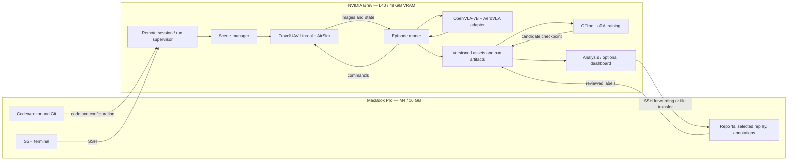
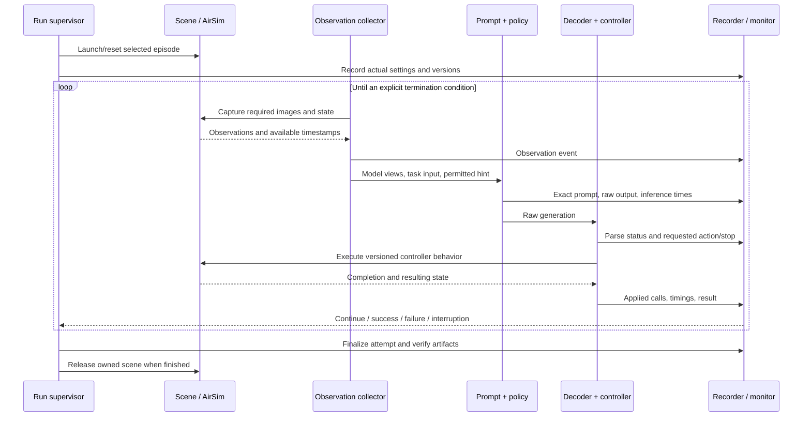

# AeroVLA on Mac + NVIDIA Brev L40: system design and execution plan

Status: design only. Remote deployment has not started. The user will provide Brev access after reviewing this plan. Level 1 is excluded.

The broad execution stages below are now refined into short releases in [IMPLEMENTATION_PLAN.md](IMPLEMENTATION_PLAN.md). Use its P01–P14 phase IDs for delivery, with documentation, reports and actual video evidence governed by [DELIVERY_STANDARD.md](DELIVERY_STANDARD.md).

This document distinguishes **verified**, **user-reported**, **proposed**, and **pending verification** information. Proposed choices are design recommendations, not claims about software already installed or experimental results already achieved.

## 1. Confirmed inventory and decisions still open

| Item | Value | Evidence/status |
|---|---|---|
| Local computer | MacBook Pro, Apple M4, 16 GB memory | Verified using local `system_profiler`; it reports M4, not M4 Pro |
| Local operating system | macOS 26.6.2 | Verified using `sw_vers` |
| GPU host | NVIDIA Brev | User-reported |
| GPU | NVIDIA L40, 48 GB VRAM | User-reported; GPU UUID and exposed/free memory require remote inspection |
| Host memory | 192 GB RAM | User-reported |
| CPU allocation | 26 CPUs, x86_64 | User-reported; physical cores versus vCPUs not established |
| Storage allocation | 625 GB | User-reported; free capacity, mount points, and persistence are unverified |
| Permission | User authorizes software/model/dataset setup; access to follow plan review | User instruction; no remote connection attempted |
| Remote OS/version | Unknown | Inspect after access; do not select an Ubuntu release by assumption |
| Driver/toolkit/graphics libraries | Unknown | Inspect before installation or changes |
| Network access and installation method | Unknown | Verify SSH, downloads, package access, and permissions |
| Goal-information policy | Decision pending | Official goal-bearing-assisted reproduction versus unknown-target navigation |
| Expert correction source | Decision pending before correction collection | Human pilot, validated planner, or another explicitly defined source |

The L40's 48 GB is GPU memory; the host's 192 GB is system memory. They have separate capacity and performance constraints. NVIDIA documents the L40 as a 48 GB graphics/compute GPU. [NVIDIA L40 datasheet](https://images.nvidia.com/content/Solutions/data-center/vgpu-L40-datasheet.pdf).

The allocation is a candidate for combined simulation and inference. It has not yet passed a workload test. No additional machine or storage purchase is part of this plan.

## 2. Objective and task boundary

Build a reproducible simulated UAV navigation experiment around the released AeroVLA policy and TravelUAV environments. Establish baseline behavior, collect correctly labeled recovery examples, continue supervised adaptation, and compare checkpoints on held-out missions.

The initial deliverable is one functioning map with 20 fully accounted-for episodes. The research deliverable is a versioned comparison of original and adapted policies, including failures, timings, and evaluation uncertainty.

There are two distinct task specifications:

| Task | Available information | Implication |
|---|---|---|
| Official reproduction | Target description plus target location used to derive a coarse bearing hint | Closest starting point to the released AeroVLA evaluator; proposed first route, awaiting user selection |
| Unknown-target navigation | Description and observations; no known target location | Requires adapted inputs and a distinct evaluation protocol; a no-hint policy ablation is possible, while search/memory/goal-localization modules are candidate additions |

The code's hint is computed from target position minus drone position, transformed using orientation. An IMU alone does not supply the target coordinates. Removing this input changes the task. [Pinned policy wrapper](https://github.com/XuPeng23/AeroVLA/blob/e37685afb8953d1f5a09155d7255960cee1bfd9d/src/model_wrapper/aerovla_wrapper_ui.py).

PX4 SITL is a later, separate milestone. Physical UAV hardware, actual touchdown validation, and deployment to an onboard computer have not been specified.

## 3. High-level architecture

**Proposed placement:** the Mac is the operator workstation. Brev owns all simulator, observation, inference, action, recording, and training work. The flight loop remains on one host.



The Mac connection is used for starting jobs, checking progress, transferring selected artifacts, and reviewing labels. A remote job must not wait for the Mac to receive each image or calculate each action.

### Resource ownership

| Work | Mac | Brev CPU/RAM | L40 |
|---|---|---|---|
| Editing, configuration, source review | Primary | Repository copy | — |
| Scene launch and episode bookkeeping | Operator interface | Primary | — |
| Unreal rendering | Replay viewer | Engine host work | Graphics workload |
| AeroVLA inference | Results viewer | Preprocessing and host buffers | Model inference |
| Raw recording and dataset preparation | Selected review files | Primary storage/processing | Only where required |
| Supervised adaptation | Training monitor | Data loader and optimizer support | Training workload |
| Reports | View/download | Generate from artifacts | Usually unnecessary |

Start with **one active simulator and one policy**, with evaluation batch size one. Training and simulation/evaluation run in separate phases on the same GPU. Additional concurrency is considered only after measured memory, timing, and storage results.

## 4. Process and network design

The initial deployment uses the repository's Python integration. The policy resides in the evaluator process; an HTTP model-serving layer is unnecessary for this design.

| Process | Responsibility | Lifecycle |
|---|---|---|
| Remote durable session | Keep jobs attached to a remote session and preserve console access | Operator controlled |
| Scene manager | Generate settings and start/stop a selected environment | Started before evaluator |
| Unreal environment | Physics, rendering, vehicle APIs | Owned by run supervisor/scene manager |
| Evaluator and policy | Dataset loading, prompt construction, inference, actions, monitors | One experiment run |
| CPU helper workers | Existing observation/state bookkeeping | Children of evaluator |
| Recorder | Proposed event writer inside the runner, with bounded buffering | Same run lifetime |
| Trainer | Offline dataset loading and checkpoint production | Separate GPU phase |
| Report/dashboard process | Read completed artifacts and training logs | Optional, independently restartable |

The scene manager defaults to loopback `127.0.0.1:30000`; scene ports start at the first available `30001` and above. Record actual allocated ports. The server launches an offscreen binary and generates settings. Its current template uses SimpleFlight, `ClockSpeed=10`, and `LockStep=true`; those values must be recorded and checked at runtime. A misspelled physics-engine setting means the effective physics engine should not be inferred from that field. [Pinned scene manager](https://github.com/XuPeng23/AeroVLA/blob/e37685afb8953d1f5a09155d7255960cee1bfd9d/airsim_plugin/AirVLNSimulatorServerTool.py).

Proposed network policy: keep simulator/control traffic host-internal; expose operator tools through the supported SSH connection. Optional reports bind to loopback and are viewed through an SSH tunnel. Actual SSH address, port, username, key, forwarding support, and firewall configuration are pending access.

Use a remote durable session such as tmux if available or installable. This handles client disconnection, not host shutdown. Persist artifacts to a verified persistent mount. [OpenSSH](https://man.openbsd.org/ssh), [tmux](https://github.com/tmux/tmux/wiki).

The supervisor will keep process IDs, detect failures, flush artifacts, and stop only processes belonging to its run. A dropped SSH connection leaves the remote job running; a simulator crash marks the episode interrupted and records a retry as a new attempt.

## 5. Software stack and version policy

**Proposed installation route:** Conda environment for AeroVLA on a verified compatible remote Linux host, with the compiled simulator running natively. Docker is an alternative if the actual Brev environment requires it or host-library compatibility warrants it. A container must provide graphics support as well as CUDA. No driver replacement is scheduled before inspecting the working installation.

The source revision inspected is `e37685afb8953d1f5a09155d7255960cee1bfd9d`. Pin it for the first reproduction; record every local patch. Other asset revisions must be resolved and recorded at acquisition.

| Layer | Reference version or component | Status |
|---|---|---|
| Python | 3.10 | Author reference |
| PyTorch | 2.1.2, CUDA 11.8 wheel build | Author reference |
| Torchvision | 0.16.2 | Repository pin |
| Transformers | 4.42.4 | Repository pin |
| PEFT | 0.11.1 | Repository pin |
| Accelerate | 0.32.1 | Repository pin |
| BitsAndBytes | 0.43.1 | Repository pin; listed dependency is not proof quantization is active |
| timm | 0.9.10 | Repository pin |
| Einops | 0.6.1 | Repository pin |
| FlashAttention | 2.5.8 | Repository pin; runtime selection/build must be verified |
| AirSim Python client | 1.8.1 | Repository pin |
| msgpack-rpc-python | 0.4 | Repository pin; inspect documented RPC fix |
| Tornado | 4.5.3 | Repository pin |
| NumPy | 1.26.3 | Repository pin |
| SciPy | 1.15.0 | Repository pin |
| OpenCV | 4.10.0.84 | Repository pin |
| Pillow | 10.2.0 | Repository pin |
| tqdm / yacs / psutil | 4.67.1 / 0.1.8 / 6.1.1 | Repository pins |
| Base policy | `openvla/openvla-7b` | Released base; revision pending lock |
| Adapter | `XuPeng23/AerialVLA`, `aero_vla` folder | Released adapter; revision pending lock |
| Simulator | Selected compiled TravelUAV environment | Exact binary/hash and effective Unreal/AirSim versions pending inventory |

[Pinned requirements](https://github.com/XuPeng23/AeroVLA/blob/e37685afb8953d1f5a09155d7255960cee1bfd9d/requirements.txt), [reference setup](https://github.com/XuPeng23/AeroVLA).

The import/tool audit also identified undeclared or system dependencies to check: `numba`, `attrs` (`attr` import), TensorBoard for training, Tk support imported by the wrapper, and `netstat` for port/process discovery. Choose compatible versions through import and dependency checks; no version is invented here. FlashAttention builds may additionally require a compiler, compatible toolkit, packaging, and ninja. [FlashAttention 2.5.8 instructions](https://github.com/Dao-AILab/flash-attention/blob/v2.5.8/README.md).

Keep modern analysis/notebook dependencies in a separate environment if they conflict with the legacy runtime. CSV/JSON reports are the initial reporting interface; a database, web backend, or hosted tracking service is not a prerequisite.

A newer NVIDIA driver can run older supported CUDA applications. The CUDA version printed by `nvidia-smi` is not the same thing as the locally installed toolkit or PyTorch wheel runtime. [NVIDIA CUDA compatibility](https://docs.nvidia.com/deploy/cuda-compatibility/why-cuda-compatibility.html). Docker graphics capabilities require separate attention. [NVIDIA container runtime capabilities](https://docs.nvidia.com/datacenter/cloud-native/container-toolkit/latest/docker-specialized.html).

## 6. Low-level module contracts

These are **proposed interfaces** around the existing repository. Their implementations are future work.

| Module | Input | Output and responsibility |
|---|---|---|
| Asset validator | Asset manifest and paths | Verified files, hashes, sizes, executable mappings, and missing-dependency report |
| Experiment runner | Resolved run config + frozen episode list | Run/attempt IDs, job state, artifacts, completion accounting |
| Scene supervisor | Map, seed, spawn configuration | Scene handle, actual settings, ports, process IDs, lifecycle events |
| Observation collector | Scene handle | Timestamped image references, pose/IMU, contact data, capture provenance |
| Goal-information provider | Task specification, state, permitted goal source | Hint and provenance, or explicit unavailable status |
| Prompt builder | Instruction and permitted hint | Exact model prompt and its hash |
| Policy adapter | Front/down observations + prompt | Raw token IDs/text, model revision, inference timing |
| Action decoder | Raw generation + codec version | Valid displacement, explicit stop intent, or parse error |
| Controller adapter | Valid requested action + fresh execution state | Actual calls, timings, applied motion, completion/error status |
| Evaluation monitor | States, contacts, policy intent, commands | Independent success, proximity, collision, stuck, timeout, and invalid-output fields |
| Recorder | Events from all modules | Append-only event log and referenced image/state artifacts |
| Training exporter | Validated observations + approved expert labels | Upstream-compatible training view plus provenance manifest |
| Checkpoint evaluator | Frozen split, protocol, candidate | Per-episode results and reproducible summary |

Use explicit units and coordinate conventions in interfaces. Store position in metres, angles in radians, and quaternion ordering in the schema. Verify NED/positive-down behavior and yaw signs with controlled simulator motions before accepting the adapter. No sensor cadence or control frequency is assumed.

## 7. Runtime semantics and the observation-action sequence

The released decoder uses 99 bins with forward `[0,5]` metres, down `[-5,5]` metres, and yaw `[-1.1,1.1]` radians. Inference takes current front/down views, forms a vertical mosaic, and uses the base image processor. The wrapper uses BF16 model loading and greedy generation with at most 20 new tokens. Its parser can convert malformed output into zeros, which can trigger stopping. The new decoder should distinguish parse error from intentional stopping, with that change registered as a protocol change. [Pinned wrapper](https://github.com/XuPeng23/AeroVLA/blob/e37685afb8953d1f5a09155d7255960cee1bfd9d/src/model_wrapper/aerovla_wrapper_ui.py).

The executor rotates first. For `abs(yaw)<0.25`, it translates along the new heading; for larger yaw changes it applies vertical motion without the forward component. It then issues zero velocity for 0.5 seconds. The action path unpauses the simulator and does not pause it again before returning. It samples one endpoint state/IMU and duplicates that record five times. Capture retrieves five RGB and five depth views; only two RGB views enter the policy. Depth is clipped/scaled to uint8, and response timestamps are discarded. These are inspected implementation details, not measured rates. [Pinned executor and capture](https://github.com/XuPeng23/AeroVLA/blob/e37685afb8953d1f5a09155d7255960cee1bfd9d/airsim_plugin/AirVLNSimulatorClientTool_AeroVLA.py).

Consequently, do not describe this checkout as a simulator that pauses at every inference. Initial reset is paused; subsequent inference can occur while simulation time advances. Do not interpret five repeated records as five physical samples. `ClockSpeed`, wall time, observation age, and requested command duration are distinct.



The diagram is the proposed instrumented design. Preserve an identifiable original-protocol run before changing parsing, stopping, clocks, cameras, or execution. Log instrumentation overhead because added work can affect an unpaused simulation. A paused-at-inference mode or clock-speed-one mode is a separate experimental configuration, not a silent fix.

## 8. Assets and storage on the 625 GB allocation

Store large assets directly on the verified persistent Brev mount. Keep one canonical base-model copy and use references where possible instead of accidentally duplicating caches and model directories.

| Asset | Verified public listing | Acquisition policy |
|---|---:|---|
| OpenVLA base repository | About 15.1 GB | Lock model, processor, tokenizer, and custom-code revision together |
| AeroVLA release repository | About 720 MB, including a 257 MB training JSON | Acquire adapter first; training JSON when needed |
| All TravelUAV environment archives | About 83.7 GB | Acquire only selected required bundle parts |
| All raw dataset archives | About 483 GB | Acquire only required map/trajectory content |
| `closeloop_envs` bundle | About 18.7 GB compressed | Includes several maps; preserve all archive parts and shared engine files |
| Carla environment bundle | About 44.7 GB compressed | Shared bundle, not one independently sized map |
| Carla Town06 raw archives | About 10.17 GB compressed | One verified-size candidate, not a finalized map selection |

[Base files](https://huggingface.co/openvla/openvla-7b/tree/main), [adapter/training index](https://huggingface.co/XuPeng23/AerialVLA/tree/main), [environment archives](https://huggingface.co/datasets/wangxiangyu0814/TravelUAV_env/tree/main), [raw archives](https://huggingface.co/datasets/wangxiangyu0814/TravelUAV/tree/main). Sizes are rounded listing values; extracted size is unverified.

The full archives plus model releases would occupy roughly 582 GB before extraction, runtime environments, recordings, or checkpoints. The initial plan therefore uses a subset. The 625 GB allocation is not a measurement of available free space.

Storage admission rule:

```text
verified free space >=
maximum additional bytes simultaneously present during the next stage
+ explicit configured reserve
```

Include archive and extracted copies while both exist, temporary extraction/download files, caches, logs, images, training snapshots, optimizer states, and failed-attempt artifacts. Measure a sample episode's output bytes and a checkpoint save before projecting capacity. Reserve size and retention limits are operational settings to finalize after inventory.

Proposed logical layout, relative to a remote root that has not yet been selected:

```text
VLA_ROOT/
  source/                 # pinned repository and recorded patches
  assets/
    models/               # base, adapter, processor, tokenizer
    envs/                 # selected binaries and shared assets
    dataset_raw/          # selected raw data and generated metadata
  manifests/              # assets, protocols, splits, runs
  configs/                # resolved experiment configurations
  runs/<run-id>/<episode-id>/<attempt-id>/
  corrections/            # expert labels and provenance
  datasets/               # immutable training exports
  checkpoints/            # candidate adapters and resume checkpoints
  reports/                # summaries, figures, selected replay
  cache/                  # bounded/referenced caches
```

No full simulator-state restore is assumed. Replay requires validated reconstruction of scene settings, object placement, initial state, and action prefix; pose teleportation alone is not proof that controller and physics state were restored.

## 9. Data and logging contracts

**Proposed canonical artifacts:**

| File | Contents |
|---|---|
| Asset manifest | Source URL, immutable revision, byte size, hash, archive parts, extraction mapping |
| Protocol manifest | Goal information, prompt template, cameras, units, codec, controller, clock policy, metrics |
| Split manifest | Explicit map/episode identifiers, purpose, exclusions, parent data hash |
| Run manifest | Model/protocol/split hashes, code/patch revision, config, seeds, actual host inventory, status |
| Episode event log | Causally linked observations, predictions, commands, results, interventions, termination |
| Training export manifest | Approved labels, observation links, expert source, label semantics, train/dev memberships |
| Checkpoint manifest | Parent model, trainable modules, dataset/config hashes, step, validation results |
| Evaluation result | Planned/completed/invalid/interrupted counts, per-episode results, aggregate uncertainty |

Example event structure below is a proposed schema, not a recorded experiment:

```text
schema_version, run_id, episode_id, attempt_id, event_id, event_type
parent_event_id, observation_id, policy_output_id, command_id
host_monotonic_ns, wall_time_utc, simulator_time_ns
image_paths, image_hashes, camera_timestamps, camera_poses
state_timestamp, position_m, quaternion_xyzw, velocity_mps
instruction, actual_prompt, hint, hint_source
raw_token_ids, raw_text, parse_status
requested_action, applied_commands, coordinate_frame, units
inference_start_end, execution_start_end, requested_duration
actual_contact, proximity_flag, stuck_flag, progress_flag
model_stop_intent, termination_reason, intervention_source
```

Unavailable fields are explicitly null with a reason. Calculate durations using a single host's monotonic clock; simulator and wall-clock timestamps are different domains. Every expert correction references the observation it labels. Do not invent image timestamps from nearby state records.

Write events incrementally, preserve raw outputs, record partial attempts, and atomically finalize complete results. Frame images are stored once and referenced by ID/hash. The Mac receives selected previews and summaries according to a bounded transfer policy. A future annotation tool can read these artifacts without entering the live action path.

The original logger persists sensors and images but omits complete policy/action timing. Its stopping and collision categories also combine several behaviors. Proposed analysis retains raw contacts separately from depth proximity, stuck detection, and progress heuristics. Original metrics remain reproducible from the pinned protocol. [Pinned logging and monitor](https://github.com/XuPeng23/AeroVLA/blob/e37685afb8953d1f5a09155d7255960cee1bfd9d/src/vlnce_src/closeloop_util.py).

## 10. Training and correction architecture

Do not start training until the baseline and data integrity gates pass. First select a correction source and validate that the supplied action is meaningful for the exact observation and action representation.

Candidate correction sources require different infrastructure: a human pilot needs a reviewed control/annotation interface; a planner needs usable scene geometry and validated motion labels; expert trajectory reuse needs a justified correspondence to the learner's state. The original policy's observed motion is not automatically an expert label.

The dataset reader consumes a JSON array with `traj_rel_dir`, `img_name`, `instruction`, `label` containing `fwd/down/yaw`, and `is_last_step/is_penultimate`. It loads paired front/down images, quantizes scalar labels, and appends `LAND` for either terminal flag. The TravelUAV merged-metadata generator is a different tool; it does not establish the new AeroVLA action-label construction method. The released training JSON's complete content and label horizon have not been inspected. [Pinned dataset reader](https://github.com/XuPeng23/AeroVLA/blob/e37685afb8953d1f5a09155d7255960cee1bfd9d/src/aerovla_dataset.py).

Proposed training flow:

```text
training missions → learner encounters difficult state → expert correction
→ semantic/timing validation → immutable labeled dataset
→ export compatible paired-image/action samples
→ continue adapter training → save candidate → development evaluation
```

The current trainer creates a fresh LoRA adapter on the base model. Continuing the released AeroVLA adapter needs an explicit implementation path that loads it as trainable, retains its projector state, and records the parent checkpoint. Resuming an interrupted training run additionally requires optimizer/scheduler state. These are distinct operations.

Reference trainer settings: BF16, LoRA rank 64, alpha 128, dropout 0.05, learning rate `2e-4`, five epochs, microbatch 2, accumulation 8, gradient checkpointing, and a trainable/saved projector. On one GPU that configured effective batch is 16. The existing trainer provides no validation dataset or best-checkpoint selection. These settings are a starting reference, not a claim they are optimal or have been tested on this L40. [Pinned trainer](https://github.com/XuPeng23/AeroVLA/blob/e37685afb8953d1f5a09155d7255960cee1bfd9d/src/train_aerovla.py).

The training implementation will verify intended trainable tensors, prompt/action loss masking, finite loss, checkpoint save/reload, parent provenance, and GPU peak. It will add development evaluation and explicit selection rules. Batch size, accumulation, worker count, and training duration are finalized from the training smoke test.

Compare the released policy, ordinary additional supervised adaptation, and recovery-focused supervised adaptation under controlled data and compute budgets. DPO remains optional after reliable preference-pair construction; it is not included as an already implemented trainer.

## 11. Evaluation design

Count unique trajectories, not rows in the split JSON. The inspected released files contain 1,418 seen trajectories across 11 maps, 629 unseen-object trajectories across eight maps, and 958 unseen-map trajectories in ModularPark. The loader deduplicates trajectory paths. [Released splits](https://github.com/XuPeng23/AeroVLA/tree/e37685afb8953d1f5a09155d7255960cee1bfd9d/data/uav_dataset), [loader](https://github.com/XuPeng23/AeroVLA/blob/e37685afb8953d1f5a09155d7255960cee1bfd9d/src/vlnce_src/env_uav.py).

Split at episode level before extracting frames. Training missions supply correction labels and gradients; development supplies diagnosis and model-selection evidence; final evaluation stays frozen. If a development or evaluation episode is used to create training corrections, explicitly reclassify it before training and stop treating its later score as untouched evaluation.

| Measurement | Interpretation |
|---|---|
| Official SR/OSR/NE/SPL | Run the pinned implementation and record its exact definition/version |
| Actual contact rate | Simulator contact evidence, distinct from inferred collision |
| Premature stop / missed stop | Policy intent relative to the defined goal criterion |
| Stuck / proximity / progress failures | Independent monitor flags |
| Invalid outputs and infrastructure errors | Account separately; include planned-episode totals |
| Inference latency and observation age | Measured distributions, not theoretical FPS |
| Episode wall time and simulation time | Both clocks, with actual clock mode |
| Peak VRAM / RAM / output bytes | Measured resource demand |
| Recovery performance | Predefined corrected-state or failure-category evaluation |

Official success can occur within 20 metres and is not proof of physical touchdown. Check metric implementation details, including goal/reference endpoints and path-length treatment, before interpreting NE/SPL as other definitions. [Metric implementation](https://github.com/XuPeng23/AeroVLA/blob/e37685afb8953d1f5a09155d7255960cee1bfd9d/utils/metric.py).

Use identical frozen missions and protocols for original/candidate comparisons. Report confidence intervals and repeated training seeds where feasible. A broader unseen-scene claim needs more than the single released unseen map. No improvement percentage or sample size for statistical power is promised before a baseline and effect-size target exist.

## 12. Compatibility work before a trusted experiment

| Finding | Planned treatment |
|---|---|
| Checkpoint/result names disagree across scripts | One resolved config and path validator |
| Metric script hardcodes a different model name | Make input/output locations explicit and verify expected episode counts |
| Evaluation template has DDP port 80005 | Remove unused distributed setting or configure a valid free port |
| Preprocessing command omits nested source directory | Use the actual TravelUAV converter path and verify every output |
| Required imports/system tools are undeclared | Audit and lock dependencies after installation checks |
| Instruction parser expects benchmark-specific substrings | Preserve official instructions for reproduction; implement and validate a structured prompt builder for custom missions |
| Simulator lifecycle can outlive evaluator | Supervisor-owned cleanup and crash reporting |
| Parser can turn malformed text into stop | Preserve original baseline behavior; introduce strict parsing as a versioned change |
| Clock/camera/state timing is not explicitly aligned | Add timestamps and measured observation-age checks; record any protocol changes |
| Several failure causes share a collision flag | Record independent raw events and retain original aggregate for comparison |
| Training starts a fresh adapter | Add an explicit released-adapter continuation path |
| Existing outputs are insufficient for corrections | Implement event-based causal logging and validated export |

Relevant sources: [evaluation shell](https://github.com/XuPeng23/AeroVLA/blob/e37685afb8953d1f5a09155d7255960cee1bfd9d/scripts/eval_aerovla.sh), [metric shell](https://github.com/XuPeng23/AeroVLA/blob/e37685afb8953d1f5a09155d7255960cee1bfd9d/scripts/metric.sh), [TravelUAV metadata converter](https://github.com/prince687028/TravelUAV/blob/main/Model/LLaMA-UAV/tools/generate_merged_json.py).

Treat behavior-changing patches as experimental changes. An instrumentation-only claim also requires measuring its timing impact.

## 13. Execution stages and acceptance gates

| Stage | Work | Required evidence to proceed |
|---|---|---|
| 0 — Host inventory | Inspect Brev OS, CPU/RAM, disk mounts/free bytes, GPU/driver, graphics, permissions | Saved inventory; compatible platform; known persistent root |
| 1 — Asset plan | Select map/task, resolve source revisions, inventory multipart archives and extraction needs | Complete manifest and storage admission check |
| 2 — Runtime setup | Install isolated dependencies and prepare compiled map | Import checks, `pip check`, executable/library checks, CUDA tensor test |
| 3 — Simulator test | Launch, retrieve images, perform bounded coordinate/yaw/vertical checks | Valid observations, expected movement, contact/timing logs, owned cleanup |
| 4 — Model test | Load released weights, process known images, decode outputs | Compatible tensors, valid generation, measured memory/latency |
| 5 — Combined episode | Run one complete official/provisionally selected task | Correct action-observation links, no missing artifacts, measured combined peak |
| 6 — Instrumented pilot | Complete 20 selected episodes | Every planned episode accounted for; replay/report; failure taxonomy checked |
| 7 — Baseline expansion | Run 100–300 exploratory episodes, then appropriate frozen split coverage | Stable resource use and statistically interpretable baseline |
| 8 — Correction pipeline | Choose expert, collect/validate labels on training missions | Correct temporal labels, no leakage, dataset manifest |
| 9 — Training pilot | Continue released adapter on a controlled subset | Finite loss, correct gradients, checkpoint reload, measured capacity |
| 10 — Controlled comparison | Compare data-matched adaptation variants | Development selection and locked final evaluation with failure breakdown |
| 11 — Later PX4 | Select compatible firmware/simulator integration and new controller protocol | Separately validated timing, setpoints, tracking, stop/landing behavior |

Tests will target meaningful failure points: camera/channel compatibility, action quantizer boundaries, coordinate signs, parser invalid-output behavior, event linkage, split leakage, checkpoint reload, and metric recomputation. Completing these gates supplies evidence; merely installing packages does not.

## 14. Measurements, cost, and outstanding work

The remote inventory will record GPU model/UUID, exposed/free VRAM, active processes, driver, toolkit availability, OS/kernel/architecture, CPU allocation, RAM/swap, disk bytes/inodes, persistent mount, and graphics availability. Inspect the selected executable's architecture and dependencies. No host settings are presumed to match the reference install.

Measure setup/download time, simulator startup, capture latency, inference latency, command execution, total episode time, output bytes, and model/training memory peaks. Use observed values to estimate experiment duration and choose retention limits.

```text
projected running time = measured episode time × planned episodes
                      + measured setup/restart overhead
                      + measured training time

projected cost = actual quoted running rate × running hours
               + actual applicable storage/transfer charges
```

No rate, total cost, training duration, real-time guarantee, or expected success improvement has been established.

When access is supplied, start at Stage 0. Before model execution, resolve the goal-information choice. Before correction collection, resolve the expert source and label-generation method. Before interpreting deployment readiness, define the required timing and physical landing criteria.

This design used AI-assisted primary-source and source-code review plus a read-only local hardware query. It has not been executed on the Brev host. The plan's remote readiness gates, measured quantities, and open decisions are deliberately left explicit.
