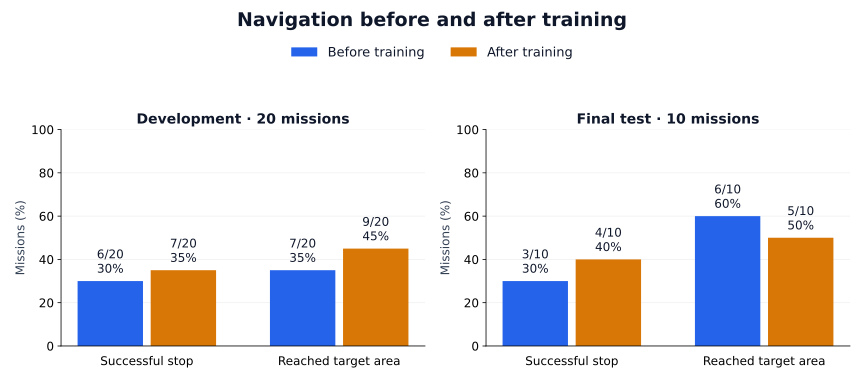
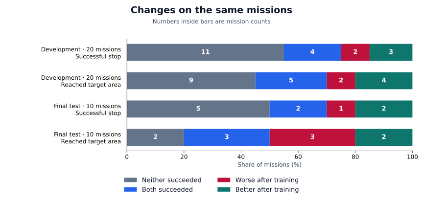
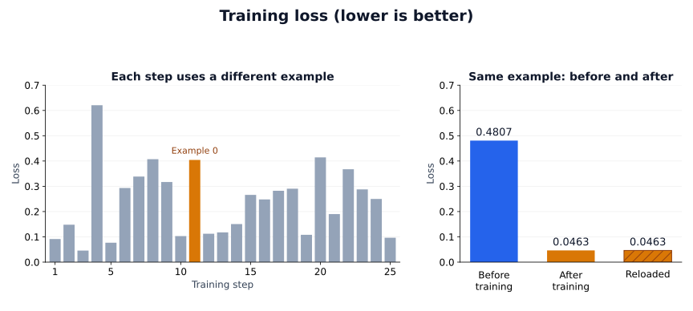

# What changed after training?

The model stopped successfully on **7 of 20 development missions**, compared with 6 for the original model. In the **10-mission final test**, the count increased from 3 to 4. These small gains came with regressions on other missions.

The [short comparison videos](../../README.md#watch-what-changed) show selected recorded images from both models: one mission that improved and one that became worse in each comparison.

## Stopping successfully and reaching the target

*Each label shows how many missions met that score, out of the group total. “Final test” is the `holdout` group in the data.*

A **successful stop (SR)** is a model stop accepted by the evaluator within 20 metres of the target. **Reached the target area (OSR)** also counts attempts with a reported action endpoint strictly less than 20 metres away, even if they later fail. Distances are three-dimensional; these are endpoint checks, not continuous flight tracking or physical landing. [Exact metric definitions](technical-report.md#what-the-scores-mean).

Target-area visits increased from **7 to 9 out of 20** in development, but fell from **6 to 5 out of 10** in the final test. The stopping result alone would hide that decline.

## Gains do not erase regressions

*The numbers count missions. A gain means the original model failed and the trained model succeeded; a regression means the reverse.*

Development had three gained successful stops and two regressions. The final test had two gains and one regression. Every planned pair is included; the same trained model was used throughout.

There were **60 scored attempts across 30 mission pairs**. Development reused the original baseline, while both final-test runs were new. One startup failed before navigation began and is recorded separately, not scored as a mission failure. [All paired outcomes](../../experiments/simulation-sft-v1/results/paired.csv).

## Learning the examples is a different result

*Each update used a different example. The separate check used training example 0, which was itself trained at update 11.*

Loss measures how well the model predicts a recorded training answer. On the fixed example, it fell from **0.4807 to 0.0463** and stayed identical after saving and reloading. This checks training fit and file integrity; it is not performance on a new example or a navigation score. [All 25 training updates](../../experiments/simulation-sft-v1/results/training-steps.csv).

This remains a small, single-map study with target-direction hints and no repeated attempts to measure variability. [Methods and limits](technical-report.md) explain why the results do not establish broad improvement. Full distances, sampled contact, action counts and timing remain in the [episode table](../../experiments/simulation-sft-v1/results/episodes.csv) and [timing record](../../experiments/simulation-sft-v1/results/timing.json). The videos use editorial holds and selected frames, not continuous or synchronized flights.
